# Module Dependency Diagram

This diagram summarizes NestJS module-level dependencies. It focuses on module
imports and shared services, not every controller, use case, repository, or
entity class.

```mermaid
flowchart TD
  AppModule["AppModule"]

  subgraph Platform["Platform configuration"]
    Config["ConfigModule"]
    TypeORM["TypeOrmModule\nMySQL"]
    CacheManager["Nest CacheModule\nRedis Keyv store"]
    Cqrs["CqrsModule"]
  end

  subgraph Shared["Shared modules"]
    UnitOfWork["UnitOfWorkModule"]
    Uuid["UuidModule"]
    SharedCache["SharedCacheModule"]
    SharedJwt["SharedJwtModule"]
    EventDispatcher["EventDispatcherModule"]
  end

  subgraph Identity["Identity and access"]
    Authentication["AuthenticationModule"]
    Authorization["AuthorizationModule"]
    Roles["RolesModule"]
    Permissions["PermissionsModule"]
    RolePermission["RolePermissionModule"]
    UserManagement["UserManagementModule"]
    CustomerManagement["CustomerManagementModule"]
    MyAccount["MyAccountModule"]
  end

  subgraph Catalog["Catalog and inventory"]
    CatalogManagement["CatalogManagementModule"]
    Genres["GenresModule"]
    Authors["AuthorsModule"]
    Languages["LanguagesModule"]
    Publishers["PublishersModule"]
    BookManagement["BookManagementModule"]
    FileStorage["FileStorageModule"]
  end

  subgraph Commerce["Commerce"]
    CartManagement["CartManagementModule"]
    Order["OrderModule"]
    OrderManagement["OrderManagementModule"]
    PaymentGateway["PaymentGatewayModule"]
  end

  subgraph Operations["Operations and integrations"]
    Dashboard["DashboardModule"]
    SalesStatistics["SalesStatisticsModule"]
    AuditLog["AuditLogModule"]
    Email["EmailModule"]
  end

  AppModule --> Config
  AppModule --> TypeORM
  AppModule --> CacheManager
  AppModule --> Cqrs
  AppModule --> Authentication
  AppModule --> Authorization
  AppModule --> UserManagement
  AppModule --> CustomerManagement
  AppModule --> CatalogManagement
  AppModule --> BookManagement
  AppModule --> FileStorage
  AppModule --> CartManagement
  AppModule --> MyAccount
  AppModule --> Order
  AppModule --> OrderManagement
  AppModule --> PaymentGateway
  AppModule --> Dashboard
  AppModule --> SalesStatistics
  AppModule --> AuditLog
  AppModule --> Email
  AppModule --> SharedCache

  Authorization --> Permissions
  Authorization --> Roles
  Roles --> Permissions
  Roles --> RolePermission
  Roles --> AuditLog
  Roles --> Authentication
  Permissions --> RolePermission
  Permissions --> AuditLog
  Permissions --> Authentication
  Permissions --> SharedCache
  Permissions --> UnitOfWork
  RolePermission --> UnitOfWork

  UserManagement --> Roles
  UserManagement --> Authentication
  UserManagement --> AuditLog
  CustomerManagement --> UserManagement
  CustomerManagement --> Authentication
  CustomerManagement --> AuditLog
  CustomerManagement --> SharedJwt
  MyAccount --> UserManagement
  MyAccount --> CustomerManagement
  MyAccount --> Authentication
  MyAccount --> AuditLog

  CatalogManagement --> Genres
  CatalogManagement --> Authors
  CatalogManagement --> Languages
  CatalogManagement --> Publishers
  Genres --> Roles
  Genres --> AuditLog
  Genres --> Authentication
  Genres --> SharedCache
  Genres --> UnitOfWork
  Genres --> Uuid
  Authors --> AuditLog
  Authors --> Authentication
  Authors --> SharedCache
  Authors --> UnitOfWork
  Authors --> Uuid
  Languages --> AuditLog
  Languages --> Authentication
  Languages --> SharedCache
  Languages --> UnitOfWork
  Publishers --> AuditLog
  Publishers --> Authentication
  Publishers --> SharedCache
  Publishers --> UnitOfWork
  Publishers --> Uuid

  BookManagement --> Genres
  BookManagement --> Authors
  BookManagement --> Languages
  BookManagement --> Publishers
  BookManagement --> FileStorage
  BookManagement --> AuditLog
  BookManagement --> Authentication
  BookManagement --> SharedCache

  CartManagement --> Authentication
  Order --> CustomerManagement
  Order --> BookManagement
  Order --> AuditLog
  Order --> Authentication
  Order --> EventDispatcher
  OrderManagement --> Order
  OrderManagement --> CustomerManagement
  OrderManagement --> AuditLog
  OrderManagement --> Authentication
  OrderManagement --> EventDispatcher
  PaymentGateway --> Order

  Dashboard --> Order
  Dashboard --> BookManagement
  Dashboard --> UserManagement
  Dashboard --> CustomerManagement
  Dashboard --> Genres
  Dashboard --> Authors
  Dashboard --> Languages
  Dashboard --> Publishers
  Dashboard --> AuditLog
  Dashboard --> Authentication

  SalesStatistics --> Authentication
  SalesStatistics -. reads order and order item entities .-> Order
  Email --> EventDispatcher
  Email --> SharedCache
  Email --> Authentication
  Email -. handles auth and order domain events .-> Authentication
  Email -. handles order lifecycle events .-> Order
  AuditLog --> Authentication

  Authentication --> UnitOfWork
  Authentication --> Uuid
  Authentication --> SharedCache
  Authentication --> SharedJwt
  Authentication --> EventDispatcher
  UserManagement --> UnitOfWork
  UserManagement --> Uuid
  UserManagement --> SharedCache
  CustomerManagement --> UnitOfWork
  CustomerManagement --> Uuid
  CustomerManagement --> SharedCache
  BookManagement --> UnitOfWork
  BookManagement --> Uuid
  CartManagement --> UnitOfWork
  CartManagement --> Uuid
  Order --> UnitOfWork
  Order --> Uuid
  OrderManagement --> UnitOfWork
  PaymentGateway --> UnitOfWork
  PaymentGateway --> Uuid
  AuditLog --> UnitOfWork
  AuditLog --> Uuid
  AuditLog --> SharedCache
  MyAccount --> UnitOfWork
  MyAccount --> Uuid
  MyAccount --> SharedCache
  FileStorage --> Uuid
```

