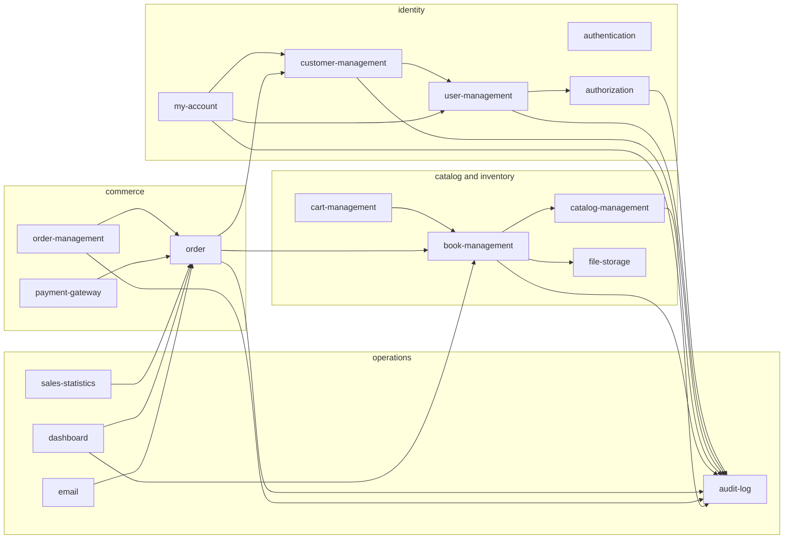
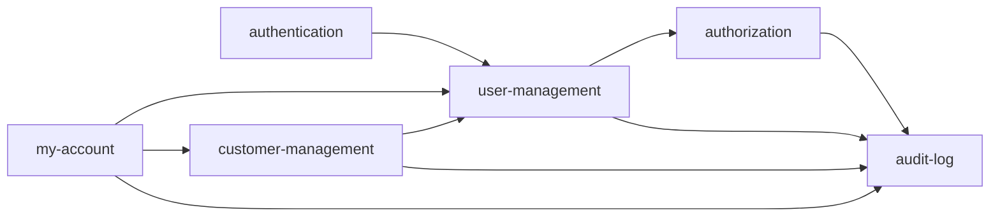
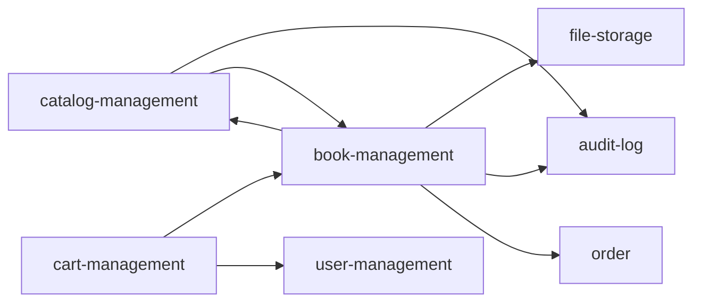
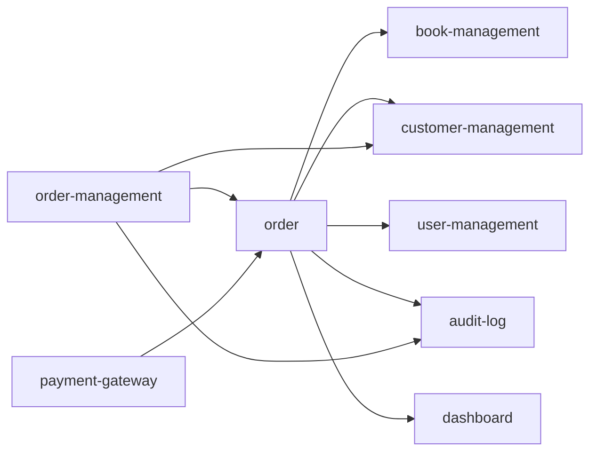
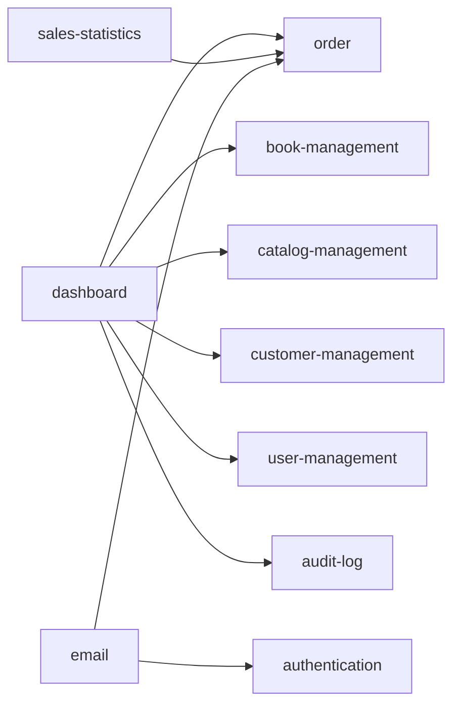

# Module Dependency Diagram

This diagram is about feature folders under `backend/src/modules/*`, not NestJS
`SomethingModule` classes. Arrows mean the source folder imports code from the
target folder.

Scope used for this diagram:

- Included: TypeScript imports inside `backend/src/modules/*`.
- Excluded: `*.module.ts` Nest wiring files and `*.spec.ts` tests.
- Excluded: shared technical modules under `backend/src/shared`.

## 1. Module Groups

## 2. Identity Dependencies

## 3. Catalog And Inventory Dependencies

## 4. Commerce Dependencies

## 5. Operations Dependencies

## Coupling Notes

These dependencies are worth knowing because they are stronger than simple
application-service composition:

- `catalog-management <-> book-management`: bidirectional infrastructure entity
  references for catalog/book relations.
- `book-management -> order`: book query infrastructure reads order/order-item
  data for sales-aware book queries.
- `order -> dashboard`: order query interfaces and implementations import
  dashboard read models for top catalog statistics.
- `cart-management -> user-management` and `order -> user-management`: cart and
  order persistence entities reference user entities.

If these areas are refactored, prefer moving shared read models or persistence
relations to a neutral boundary instead of adding more cross-folder imports.
