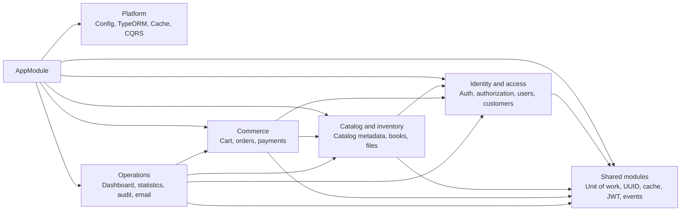
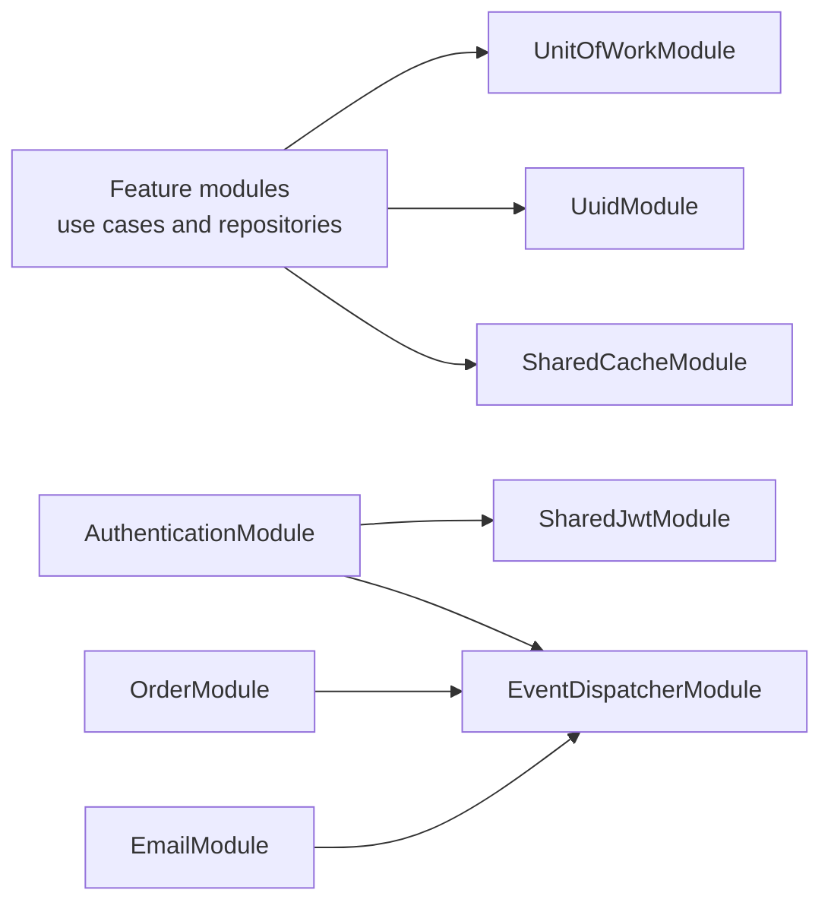
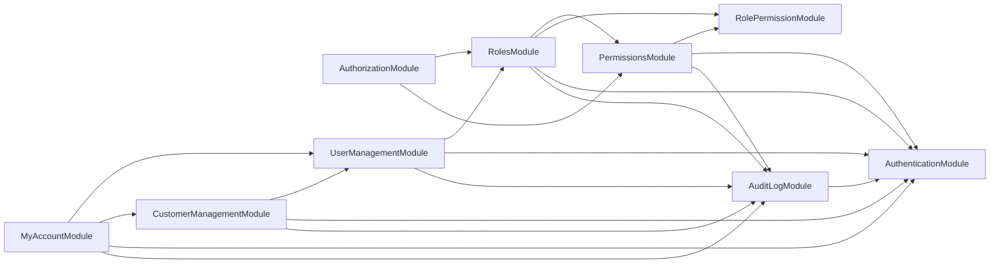
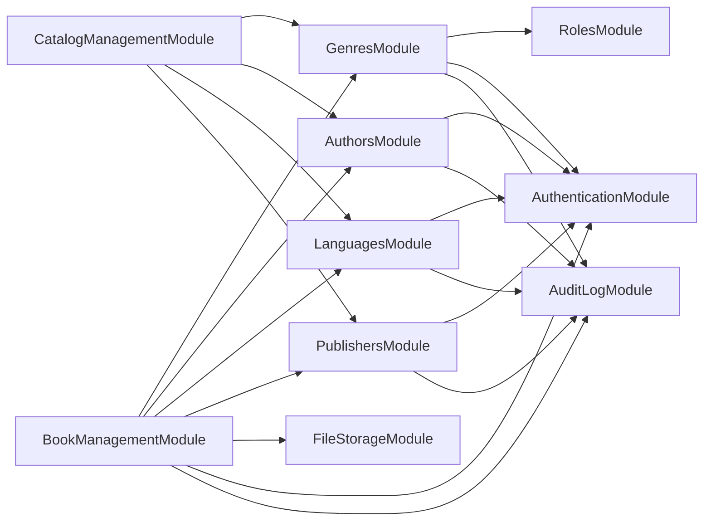
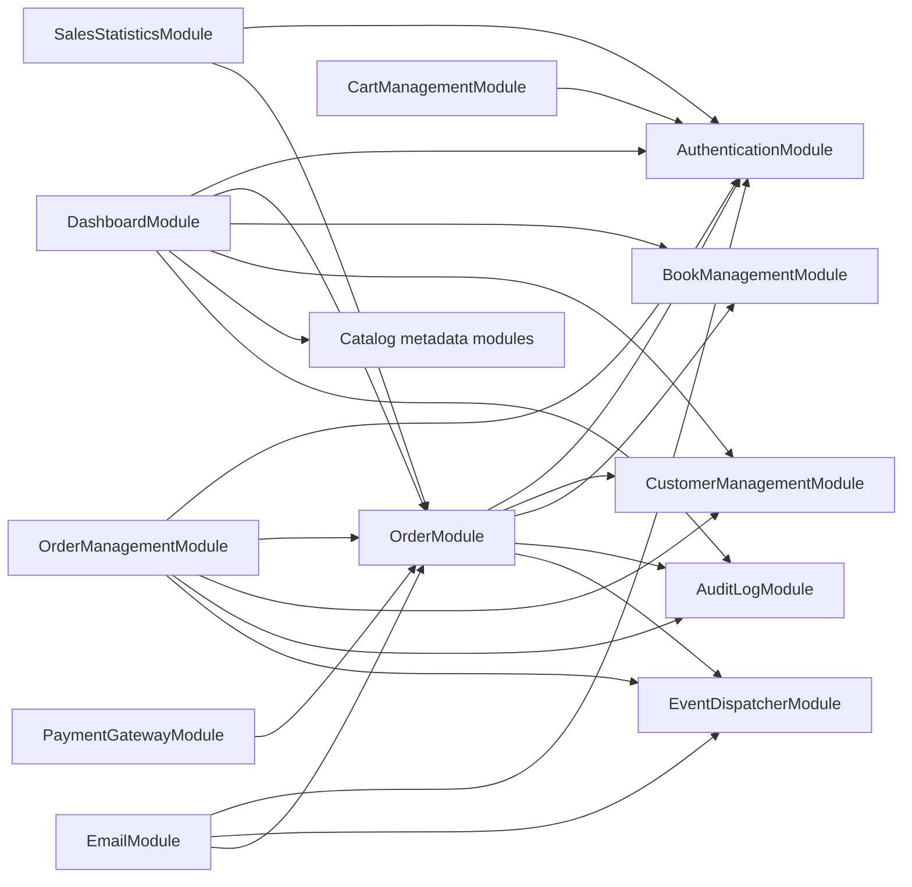

# Module Dependency Diagram

This page splits module dependencies into smaller diagrams so the relationships
are readable. `AppModule` imports every business module, so the detailed
diagrams below focus on the dependencies that matter for understanding feature
coupling.

## 1. High-Level Composition

## 2. Shared Module Usage

Most modules share the same technical dependencies. These are omitted from the
feature diagrams unless they are central to the relationship.

## 3. Identity And Access

## 4. Catalog And Inventory

## 5. Commerce And Operations

## Notes

- Arrows mean "imports or depends on exported providers from".
- The diagrams hide direct `TypeOrmModule.forFeature(...)` imports because those
  are persistence wiring, not feature-to-feature dependencies.
- `AuditLogModule` imports `AuthenticationModule`, while many feature modules
  also import `AuditLogModule`. That is a real Nest module wiring cycle in the
  current implementation, so identity and audit concerns should be handled with
  care during refactors.
