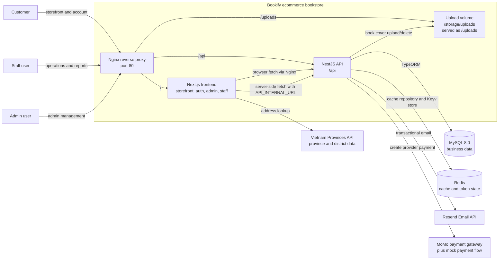

# System Context Diagram

This diagram shows the main runtime systems around Bookify. It is intentionally
kept at system boundary level; module internals are covered in
[module-dependency-diagram.md](./module-dependency-diagram.md).

